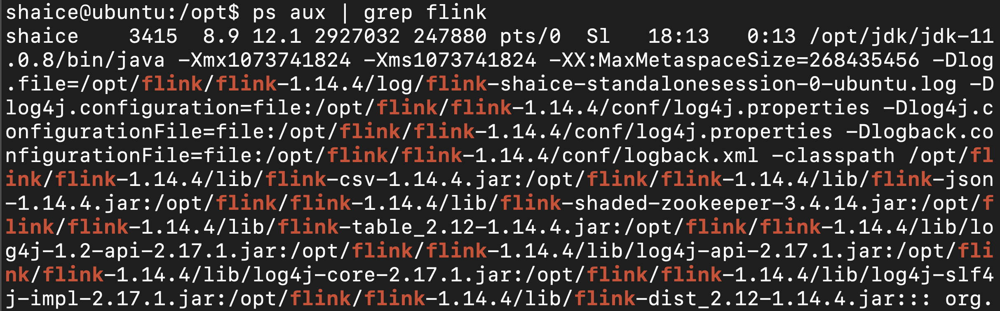
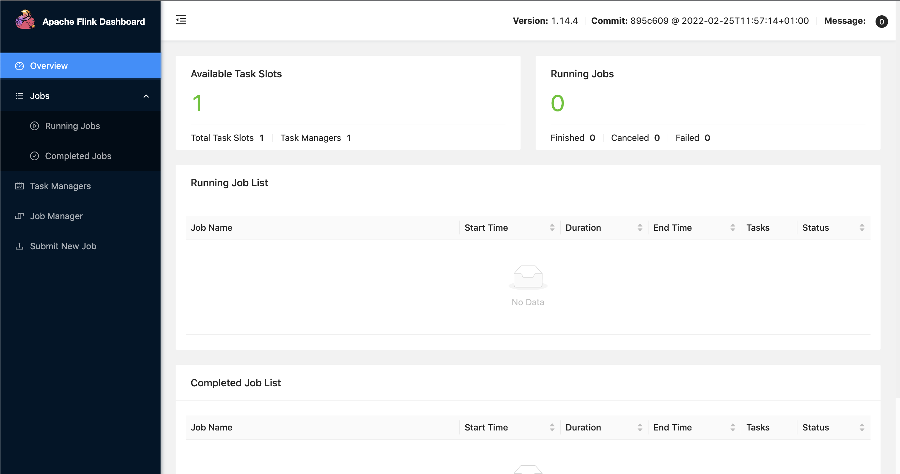

# 安裝flink 1.14.4
## 安裝依賴套件
- JDK v11 or higher(可參考[JDK11 安裝](../java/openJDK/11/adoptOpenJDK11_install.md))
  
## 下載
```
$wget --no-check-certificate https://dlcdn.apache.org/flink/flink-1.14.4/flink-1.14.4-bin-scala_2.12.tgz
```

## 解壓縮
```
$sudo mv flink-1.14.4-bin-scala_2.12.tgz /opt/
$sudo mkdir -p /opt/flink
$cd /opt
$sudo tar zxvf flink-1.14.4-bin-scala_2.12.tgz -C /opt/flink
```

## 設定Flink Home PATH
1. 編輯.bash_profile檔案
    ```
    $vi ~/.bash_profile
    ```
2. 把以下內容貼到檔案裡
    ```
    #set flink home path
    export FLINK_HOME=/opt/flink/flink-1.14.4
    export PATH=$PATH:$FLINK_HOME/bin
    ```
3. 重新載入.bash_profile
    ```
    $source ~/.bash_profile
    ```

## 確認Flink是否可運行
1. 啟動flink(standalone模式)
   ```
   $start-cluster.sh
   ```
   
2. 查看flink的執行程序
   ```
   $ps aux | grep flink
   ```
    
3. 執行成功可連到web頁面
   http://ip:8081/
   
4. 停止flink
   ```
   $stop-cluster.sh
   ```
   