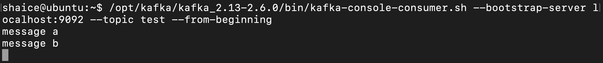

# 部署kafka 2.6.0
## 前置動作
- [已安裝kafka](kafka_install.md)

## 部署方式
  - [Standalone模式](#standalone模式)
  - [Clustered模式](#clustered模式三台broker)

## Standalone模式
1. 建立log檔存放位置的資料夾
```
$sudo mkdir $KAFKA_HOME/logs
$sudo chmod -R a+w $KAFKA_HOME/logs
```
2. 啟動zookeeper
```
$zkServer.sh start
```
3. 啟動kafka server(broker)
```
$kafka-server-start.sh -daemon $KAFKA_HOME/config/server.properties
```
4. 建立topic
```
$kafka-topics.sh --bootstrap-server localhost:9092  --create  --replication-factor 1 --partitions 1 --topic test
```
觀看此broker存在的topic，會發現出現剛建立的topic: test
```
$kafka-topics.sh --bootstrap-server localhost:9092 --list 
```
觀看此broker上的topic資訊
```
$kafka-topics.sh --bootstrap-server localhost:9092  --describe  --topic test
```
5. 測試傳送訊息到topic，並觀察consumer是否有接收到
建立producer並傳送訊息到topic: test
```
$kafka-console-producer.sh --bootstrap-server localhost:9092 --topic test
```
```
>message a
```
```
>message b
```

建立consumer並從topic: test接收訊息(運行在獨立的shell)
```
$kafka-console-consumer.sh --bootstrap-server localhost:9092 --topic test --from-beginning
```

或指定partition
```
$kafka-console-consumer.sh --bootstrap-server localhost:9092 --partition 0 --offset "4" --topic test
```
或建立consumer group
```
$kafka-console-consumer.sh --bootstrap-server localhost:9092 --topic test --group test_consumer
```
觀看此broker存在的topic，會發現出現剛建立的topic: test
```
kafka-consumer-groups.sh --bootstrap-server localhost:9092 --list
```
觀看此consumer group資訊
```
$kafka-consumer-groups.sh --bootstrap-server localhost:9092  --describe  --group test_consumer
```
刪除此consumer group
```
$kafka-consumer-groups.sh --bootstrap-server localhost:9092  --delete  --group test_consumer
```
6. 刪除topic
```
$kafka-topics.sh --bootstrap-server localhost:9092  --delete  --topic test
```
7. 停止kafka server(broker)
```
$kill -9 $(jps | grep -i Kafka | awk '{print $1}')
```
或
```
$jps | grep -i Kafka | awk '{print $1}'| xargs kill -9
```
8. 停止zookeeper
```
$zkServer.sh stop
```


## Clustered模式（三台broker）
建議自行安裝zookeeper集群, 可參考[zookeeper 安裝](../../apache%20zookeeper/3.5.8/zookeeper_install.md)和[zookeeper 部署](../../apache%20zookeeper/3.5.8/zookeeper_deploy.md)
1. 設定設定檔（$KAFKA_HOME/config/server.properties）
```
$sudo vi $KAFKA_HOME/config/server.properties
```
```
log.dirs=/opt/kafka/data
zookeeper.connect=10.211.55.14:2181,10.211.55.15:2181,10.211.55.16:2181
```
在10.211.55.18寫
```
broker.id=1
listeners=PLAINTEXT://10.211.55.18:9092
```
在10.211.55.19寫
```
broker.id=2
listeners=PLAINTEXT://10.211.55.19:9092
```
在10.211.55.20寫
```
broker.id=3
listeners=PLAINTEXT://10.211.55.20:9092
```
2. 建立kafka log.dars檔案
```
$sudo mkdir -p /opt/kafka/data
$sudo chown -R shaice:shaice /opt/kafka/data
```
3. 啟動zookeeper server
```
$zkServer.sh start
```
4. 啟動kafka server
```
$kafka-server-start.sh -daemon $KAFKA_HOME/config/server.properties
$tail -f $KAFKA_HOME/logs/server.log
```
5. 停止kafka server
```
$kill -9 $(jps | grep -i Kafka | awk '{print $1}')
```
或
```
$jps | grep -i Kafka | awk '{print $1}'| xargs kill -9
```
6. 停止zookeeper server
```
$zkServer.sh stop
```