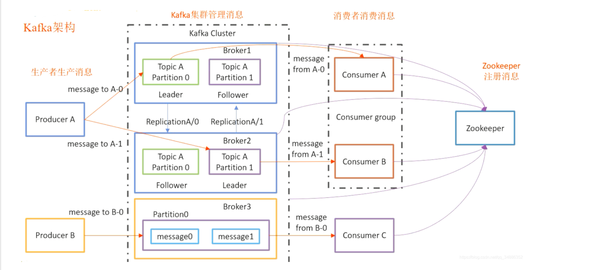

# Apache Kafka介紹
## 定位
訊息隊列系統

## 主要特色
- 分散式系統
- 訊息可備份
- 訊息可持久化（因此可做到資料流回放）

## 架構

- Topic: 訊息的別名
- Partition: 每個Topic可以有多個partition來儲存訊息，且partition可分佈在多個Broker上，在每個partition裡的訊息都是依先後順序排序儲存(FIFO)，並且會為每個訊息做標記(offset)，而Consumer會各自記錄目前讀到partition上的哪個offset的訊息
  
- Producer: 發佈訊息到Topic的指定partition上（指定partition的規則由客戶端決定）
- Consumer: 從Topic的partition收到Producer發佈的訊息，同一Topic下可以有多個Consumer Group，而每個Consumer Group可以有多個Consumer instance，但每個partition只會傳遞訊息給各Consumer Group的某一個Consumer instance（分配規則由kafka決定）
  
- Broker: 單台kafka server，可提供多個Topic
- Cluster: 多個Broker組成同一集群對外服務
