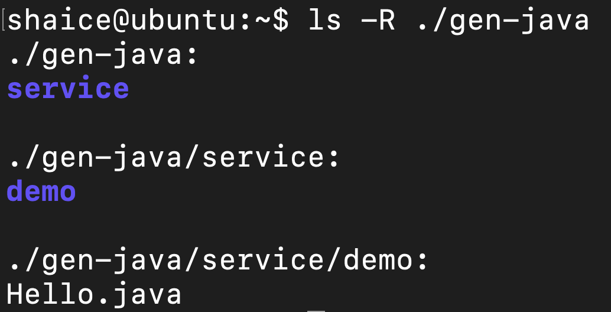

# 安裝thrift
## 安裝依賴套件
```
$sudo apt-get install automake bison flex g++ git libboost-all-dev libevent-dev libssl-dev libtool make pkg-config
```

## 手動下載thrift檔案
```
$wget http://ftp.twaren.net/Unix/Web/apache/thrift/0.13.0/thrift-0.13.0.tar.gz
```

## 解壓縮
```
$sudo mv thrift-0.13.0.tar.gz  /opt/
$sudo mkdir /opt/thrift
$cd /opt
$sudo tar zxvf thrift-0.13.0.tar.gz -C /opt/thrift
```

## build & install thrift
```
$cd /opt/thrift/thrift-0.13.0
$sudo ./configure
$sudo make
$sudo make install
```

## 驗證thrift是否有安裝成功
```
$thrift -version
```


## 驗證thrift是否可成功把.thrift檔轉成.java檔
1. 建立測試檔
   ```
   $vi Hello.thrift
   ```
   Hello.thrift的檔案內容：
   ```
    namespace java service.demo
    service Hello{
        string helloString(1:string para)
        i32 helloInt(1:i32 para)
        bool helloBoolean(1:bool para)
        void helloVoid()
        string helloNull()
    }
   ```
2. 執行thrift指令把.thrift檔轉成.java檔
   ```
   $thrift --gen java Hello.thrift
   ```
3. 檢驗gen-java目錄下的檔案
   ```
   $ls -R ./gen-java
   ```
