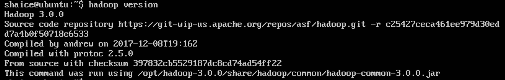

# 安裝hadoop 3.0.0
## 下載
```
$wget https://archive.apache.org/dist/hadoop/common/hadoop-3.0.0/hadoop-3.0.0.tar.gz
```

## 解壓縮
```
$sudo cp hadoop-3.0.0.tar.gz /opt/
$cd /opt
$sudo tar zxvf hadoop-3.0.0.tar.gz
```

## 設定HADOOP PATH
1. 編輯.bash_profile檔案
    ```
    $ vi ~/.bash_profile
    ```
2. 把以下內容貼到檔案裡
    ```
    export HADOOP_HOME=/opt/hadoop-3.0.0
    export PATH=$PATH:$HADOOP_HOME/bin:$HADOOP_HOME/sbin
    ```
3. 重新載入.bash_profile
    ```
    $source ~/.bash_profile
    ```
4. 驗證hadoop是否有安裝成功
    ```
    $ hadoop version
    ```
    