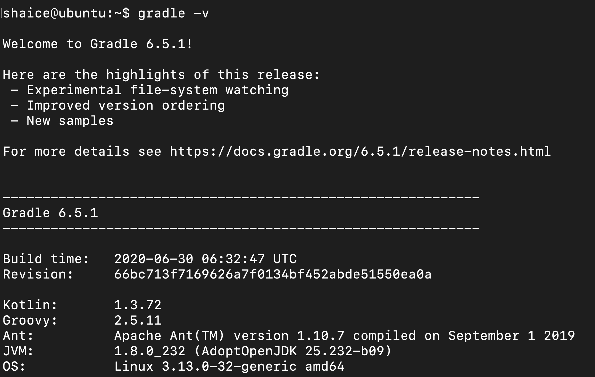

# 安裝gradle
## 安裝依賴套件
- JDK v1.8 or higher(可參考[JDK8 安裝](../openJDK/8/adoptOpenJDK8_install.md))

## 手動下載gradle binary檔案
```
$wget https://services.gradle.org/distributions/gradle-6.5.1-bin.zip
```

## 解壓縮
```
$sudo mv gradle-6.5.1-bin.zip  /opt/
$sudo mkdir /opt/gradle
$cd /opt
$sudo unzip -d /opt/gradle gradle-6.5.1-bin.zip
```

## 設定GRADLE PATH
1. 編輯.bash_profile檔案
    ```
    $ vi ~/.bash_profile
    ```
2. 把以下內容貼到檔案裡
    ```
    #set gradle path
    export GRADLE_HOME=/opt/gradle/gradle-6.5.1
    export PATH=$PATH:$GRADLE_HOME/bin
    ```
3. 重新載入.bash_profile
    ```
    $source ~/.bash_profile
    ```
4. 驗證gradle是否有安裝成功
    ```
    $gradle -v
    ```
    