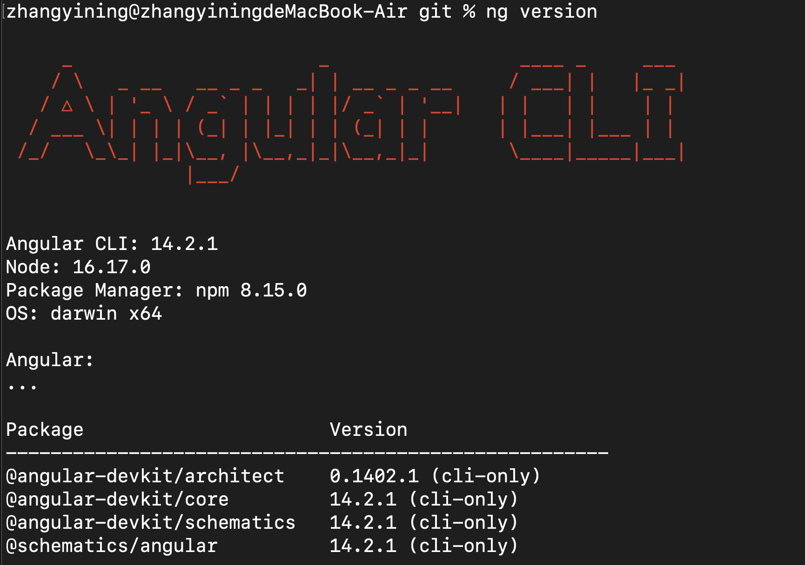

# Angular專案開發環境設定
## 前置開發環境設定
[軟體開發環境設定](install_dev_env.md)

## 用homebrew安裝Node.js(包含npm)
透過brew來安裝maven
```
$ brew install node
```
檢查node.js&npm是否有安裝
```
$ node -v
$ npm -v
```


## 用npm安裝angular cli指令套件
```
$ npm install -g @angular/cli
```
檢查angular cli是否有安裝
```
$ ng version
```


## Visual Studio Code安裝Angular專案開發套件
- Angular
    .png)
- Angular material
    

## 建立新的Angular專案
```
$ ng new my-app
```

```
$ ng serve
```