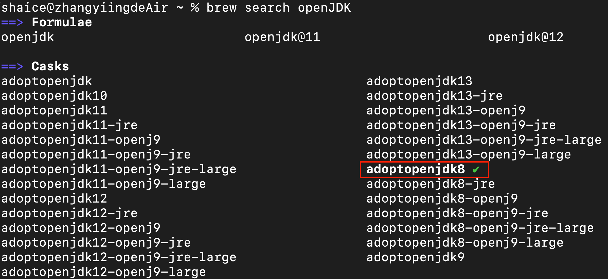
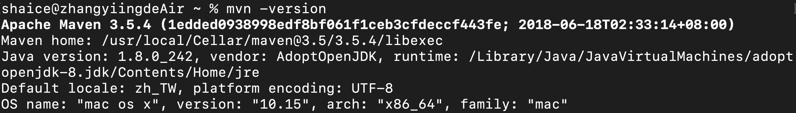

# 安裝Java開發環境
## 開發環境建置
[安裝軟體開發環境](install_dev_env.md)

## 用homebrew安裝OpenJDK 8
尋找可下載的openJDK8
```
$ brew tap AdoptOpenJDK/openjdk
$ brew search openJDK
```


透過brew cask來安裝adoptopenjdk8
```
$ brew install --cask adoptopenjdk8
```

## 設定java環境變數
1. 編輯zprofile檔案
    ```
    $ vi ~/.zprofile
    ```
2. 把以下內容貼到檔案裡
    ```
    export JAVA_8_HOME=$(/usr/libexec/java_home -v1.8)
    alias java8='export JAVA_HOME=$JAVA_8_HOME'
    
    # default to Java 8
    java8

    export PATH=$JAVA_HOME/bin:$PATH
    ```
3. 重新載入zprofile
    ```
    $ source ~/.zprofile
    ```
4. 驗證java是否有安裝成功
    ```
    $ java -version
    ```
    

## 用homebrew安裝Maven
透過brew來安裝maven
```
$ brew install maven
```

## 設定maven環境變數
1. 編輯zprofile檔案
    ```
    $ vi ~/.zprofile
    ```
2. 把以下內容貼到檔案裡
    ```
    export MAVEN_HOME=/usr/local/opt/maven

    export PATH=$MAVEN_HOME/bin:$PATH
    ```
3. 重新載入zprofile
    ```
    $ source ~/.zprofile
    ```
4. 驗證maven是否有安裝成功
    ```
    $ maven -version
    ```
    

## Visual Studio Code安裝Java專案開發套件
- Java Extension Pack
    
- Markdown
    
    
- Restful api test
    
- Angular
    