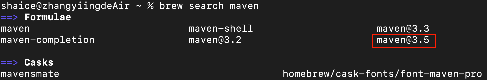
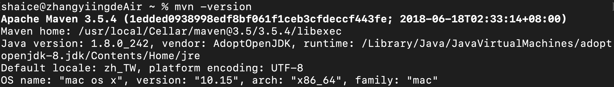

# 安裝Java開發環境
## 安裝homebrew
[homebrew管網](https://brew.sh/index_zh-tw)

安裝指令如下：
```
$ /usr/bin/ruby -e "$(curl -fsSL https://raw.githubusercontent.com/Homebrew/install/master/install)"
```

## 用homebrew安裝OpenJDK 8
尋找可下載的openJDK8
```
$ brew search openJDK
```


透過brew cask來安裝adoptopenjdk8
```
$ brew tap AdoptOpenJDK/openjdk
$ brew cask install adoptopenjdk8
```

設定java環境變數
1. 編輯zprofile檔案
    ```
    $ vi ~/.zprofile
    ```
2. 把以下內容貼到檔案裡
    ```
    export JAVA_8_HOME=$(/usr/libexec/java_home -v1.8)
    alias java8='export JAVA_HOME=$JAVA_8_HOME'
    
    # default to Java 8
    java8

    export PATH=$JAVA_HOME/bin:$PATH
    ```
3. 重新載入zprofile
    ```
    $ source ~/.zprofile
    ```
4. 驗證java是否有安裝成功
    ```
    $ java -version
    ```
    

## 用homebrew安裝Maven
尋找可下載的maven
```
$ brew search maven
```


透過brew來安裝maven 3.5
```
$ brew install maven@3.5
```

設定maven環境變數
1. 編輯zprofile檔案
    ```
    $ vi ~/.zprofile
    ```
2. 把以下內容貼到檔案裡
    ```
    export MAVEN_HOME=/usr/local/opt/maven@3.5

    export PATH=$MAVEN_HOME/bin:$PATH
    ```
3. 重新載入zprofile
    ```
    $ source ~/.zprofile
    ```
4. 驗證maven是否有安裝成功
    ```
    $ maven -version
    ```
    

## 安裝IDE: Visual Studio Code 
安裝Visual Studio Code
[Visual Studio Code下載點](https://code.visualstudio.com/docs/setup/setup-overview)

下載執行Java的套件： 
- Java Extension Pack
    
- XML
    