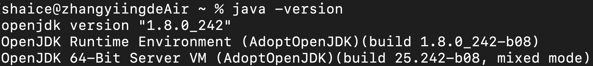
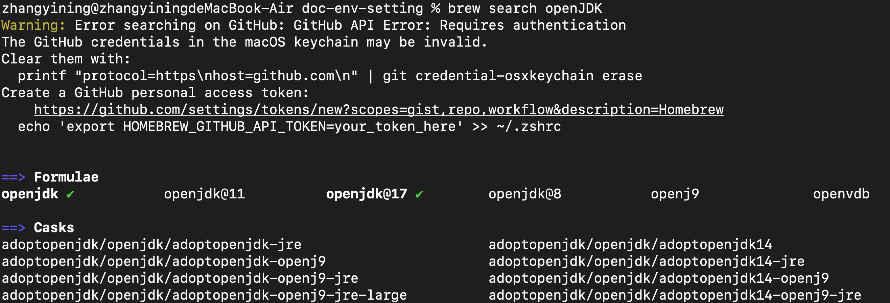
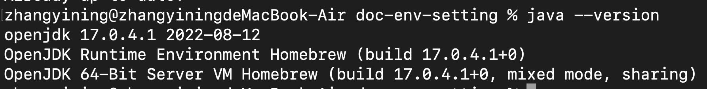

## 用homebrew安裝OpenJDK 8
### 安裝java
尋找可下載的openJDK8
```
$ brew tap AdoptOpenJDK/openjdk
$ brew search openJDK
```


透過brew cask來安裝adoptopenjdk8
```
$ brew install --cask adoptopenjdk8
```

### 設定java環境變數
1. 編輯zprofile檔案
    ```
    $ vi ~/.zprofile
    ```
2. 把以下內容貼到檔案裡
    ```
    export JAVA_8_HOME=$(/usr/libexec/java_home -v1.8)
    alias java8='export JAVA_HOME=$JAVA_8_HOME'
    
    # default to Java 8
    java8

    export PATH=$JAVA_HOME/bin:$PATH
    ```
3. 重新載入zprofile
    ```
    $ source ~/.zprofile
    ```
4. 驗證java是否有安裝成功
    ```
    $ java -version
    ```
    


## 用homebrew安裝OpenJDK 17
### 安裝java
透過brew來安裝adoptopenjdk17
```
$ brew search openJDK
$ brew install openjdk@17
```


### 設定java環境變數
1. 編輯zprofile檔案
    ```
    $ vi ~/.zprofile
    ```
2. 把以下內容貼到檔案裡
    ```
    export JAVA_17_HOME=/usr/local/opt/openjdk@17/bin
    alias java17='export JAVA_HOME=$JAVA_17_HOME'
    
    # default to Java 17
    java17

    export PATH=$JAVA_HOME/bin:$PATH
    ```
3. 重新載入zprofile
    ```
    $ source ~/.zprofile
    ```
4. 驗證java是否有安裝成功
    ```
    $ java -version
    ```
    