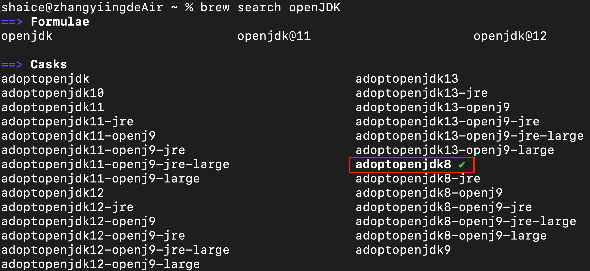
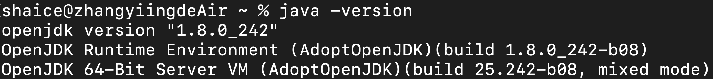
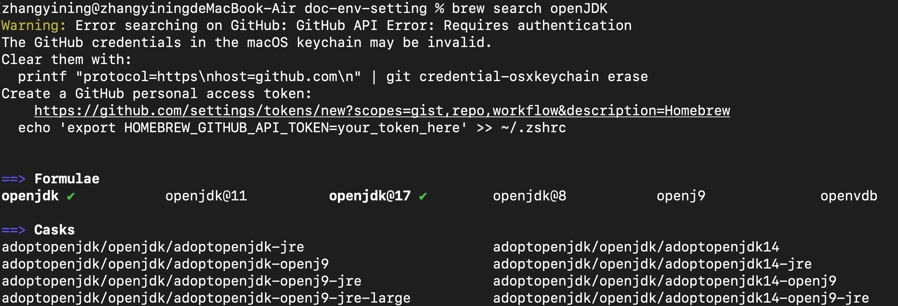
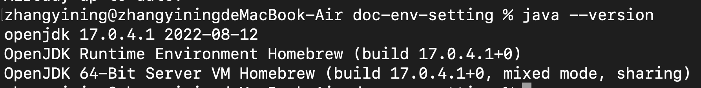
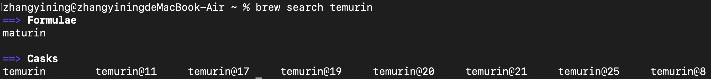
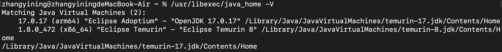

## 安裝java
### 用homebrew安裝OpenJDK 8
尋找可下載的openJDK8
```bash
brew tap AdoptOpenJDK/openjdk
brew search openJDK
```


透過brew cask來安裝adoptopenjdk8
```bash
brew install --cask adoptopenjdk8
```
設定java環境變數
1. 編輯zprofile檔案
    ```bash
    vi ~/.zprofile
    ```
2. 把以下內容貼到檔案裡
    ```
    export JAVA_8_HOME=$(/usr/libexec/java_home -v1.8)
    alias java8='export JAVA_HOME=$JAVA_8_HOME'
    
    # default to Java 8
    java8

    export PATH=$JAVA_HOME/bin:$PATH
    ```
3. 重新載入zprofile
    ```bash
    source ~/.zprofile
    ```
4. 驗證java是否有安裝成功
    ```bash
    java -version
    ```
    


### 用homebrew安裝OpenJDK 17
透過brew來安裝adoptopenjdk17
```bash
brew search openJDK
brew install openjdk@17
```

設定java環境變數
1. 編輯zprofile檔案
    ```bash
    vi ~/.zprofile
    ```
2. 把以下內容貼到檔案裡
    ```
    export JAVA_17_HOME=/usr/local/opt/openjdk@17/bin
    alias java17='export JAVA_HOME=$JAVA_17_HOME'
    
    # default to Java 17
    java17

    export PATH=$JAVA_HOME/bin:$PATH
    ```
3. 重新載入zprofile
    ```bash
    source ~/.zprofile
    ```
4. 驗證java是否有安裝成功
    ```bash
    java -version
    ```
    

## 用homebrew安裝temurin 8, 17
AdoptOpenJDK項目已於2021年遷移至Eclipse Temurin，原Homebrew Cask adoptopenjdk因上游停止維護，於2024年12月16日被官方禁用。當前應使用Eclipse Temurin的版本替代

尋找可下載的java版本
```bash
brew search temurin
```


透過brew cask來安裝java8、java17(或其他版本)
```bash
brew install --cask temurin@8
brew install --cask temurin@17
```
查看已安裝的java版本
```bash
/usr/libexec/java_home -V
```

設定java環境變數
1. 編輯zprofile檔案
    ```bash
    vi ~/.zprofile
    ```
2. 把以下內容貼到檔案裡
    ```
    export JAVA_8_HOME=$(/usr/libexec/java_home -v1.8)
    alias java8='export JAVA_HOME=$JAVA_8_HOME'

    export JAVA_17_HOME=$(/usr/libexec/java_home -v17)
    alias java17='export JAVA_HOME=$JAVA_17_HOME'
    
    # default to Java 8
    java8

    export PATH=$JAVA_HOME/bin:$PATH
    ```
3. 重新載入zprofile
    ```bash
    source ~/.zprofile
    ```
4. 驗證java是否有安裝成功
    ```bash
    java -version
    ```
    
