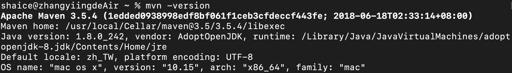
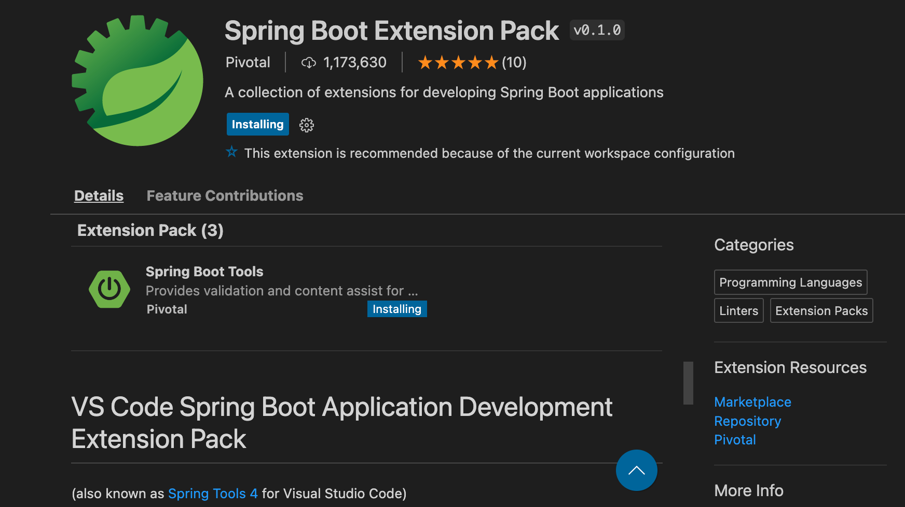

# Springboot專案開發環境設定
## 前置開發環境設定
[軟體開發環境設定](./install_dev_env.md)

## 安裝Java
[安裝OpenJDK](./install_java_env.md)

## 用homebrew安裝Maven
透過brew來安裝maven
```
$ brew install maven
```

## 設定maven環境變數
1. 編輯zprofile檔案
    ```
    $ vi ~/.zprofile
    ```
2. 把以下內容貼到檔案裡
    ```
    export MAVEN_HOME=/usr/local/opt/maven

    export PATH=$MAVEN_HOME/bin:$PATH
    ```
3. 重新載入zprofile
    ```
    $ source ~/.zprofile
    ```
4. 驗證maven是否有安裝成功
    ```
    $ maven -version
    ```
    

## Visual Studio Code安裝Java專案開發套件
- Java Extension Pack
    
- Restful api test
    
- Springboot
    