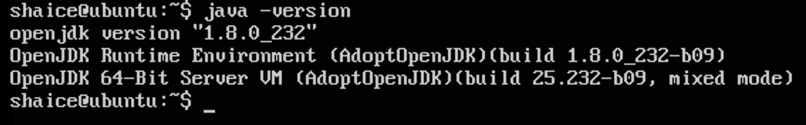

# 安裝java8
## 從adoptOpenJDK下載
```
$wget https://github.com/AdoptOpenJDK/openjdk8-binaries/releases/download/jdk8u232-b09/OpenJDK8U-jdk_x64_linux_hotspot_8u232b09.tar.gz
```

## 解壓縮
```
$sudo cp OpenJDK8U-jdk_x64_linux_hotspot_8u232b09.tar.gz /opt/
$cd /opt
$sudo tar zxvf OpenJDK8U-jdk_x64_linux_hotspot_8u232b09.tar.gz
$sudo mv shaice:shaice -R jdk8u232-b09
```

## 設定JAVA PATH
1. 編輯.bash_profile檔案
    ```
    $ vi ~/.bash_profile
    ```
2. 把以下內容貼到檔案裡
    ```
    export JAVA_HOME=/opt/jdk8u232-b09
    export PATH=$JAVA_HOME/bin:$PATH
    ```
3. 重新載入.bash_profile
    ```
    $source ~/.bash_profile
    ```
4. 驗證java是否有安裝成功
    ```
    $ java -version
    ```
    